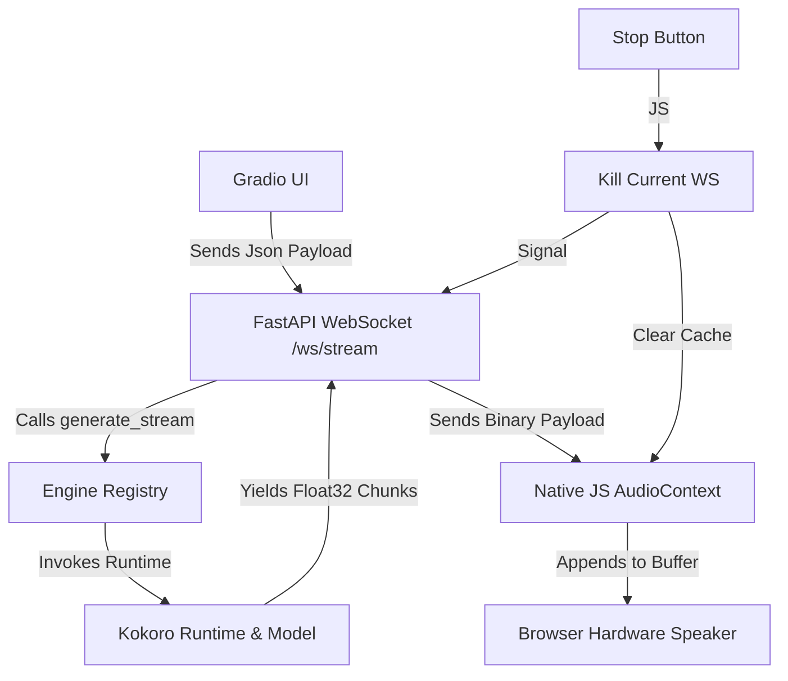

# 🏗️ Architecture Overview

The **Universal TTS Control Center** is a hybrid **FastAPI + Gradio** stack designed specifically to circumvent the audio buffering limitations found in standard high-level Web Frameworks.

## 🛠️ Components Breakdown

### 1. **FastAPI & Uvicorn**
The core process is a **FastAPI** application running on `uvicorn`. This allows us to mount a standard **Gradio** app on the root path (`/`) while exposing raw, high-performance **WebSocket** endpoints (`/ws/stream`) in the background.

### 2. **Native JavaScript Audio Engine**
Instead of using `<audio src="..."></audio>`, which browser buffers often cache and play with significant latency, we use a custom **`AudioContext` pipeline**. 
*   We open a binary WebSocket.
*   We receive raw `Float32` bytes.
*   We schedule each chunk to play at `audioCtx.currentTime + duration`.
*   This removes all "popping" or silent gaps between sentences.

### 3. The Engine Manager (`app/engines/manager.py`)
This project uses a **Strategy Pattern** with **Dynamic Discovery**. Instead of a hardcoded registry, the `PluginManager` scans the `app/engines/` directory at startup. 
*   **Auto-Discovery**: Any folder containing an `engine.py` with a `TTSPlugin` subclass is automatically loaded.
*   **Decoupling**: The Gradio UI and the WebSocket API interact only with the `TTSPlugin` interface, allowing for seamless addition/removal of models without modifying core logic.

### 4. **Zero-Shot Voice Cloning Path**
For models supporting instant cloning (ZipVoice, Genie, Chatterbox), the system implements a `StoredVoicesManager`. 
*   **Reference Audio**: Uploaded `.wav` or `.flac` files are stored in `custom_voices/`.
*   **Acoustic Extraction**: Models like Chatterbox ONNX use an internal `speech_encoder` to extract a latent representation of the reference audio at runtime.
*   **Dynamic Injection**: Cloned voices appear instantly in the frontend dropdown without requiring a server restart.

### 5. **Runtime vs Model Separation**
For extreme scalability, each engine folder (e.g., `app/engines/kokoro/`) separates **Assets/Loading** (`model.py`) from the **Inference Pipeline** (`runtime.py`). This prevents bloated runtime classes and allows for cleaner mock testing.

### 5. **Chunking & Regex Strategy**
TTS models generate audio best when input is split into manageable sentences. We expose the **`split_pattern`** parameter to the frontend, allowing for:
*   **Sentence-wise streaming**: Fast TTFB. Audio starts playing as soon as the first sentence is processed.
*   **Newline-wise streaming**: Faster than sentence-wise, but may result in longer silence if lines are very long.
*   **One-pass Batching**: High quality, but higher latency.

### 6. **One-Click Maintenance (`scripts/`)**
The project implements a **Script-per-Engine** pattern. Every model in `app/engines/` should have a corresponding bash script in `scripts/` to automate weights downloading and environment setup. This ensures the playground remains portable.

---

## 📈 Metric Collection Logic

Metrics are collected using `performance.now()` in the browser:
1.  `reqStartTime`: Captured the moment the "Start" button is clicked.
2.  `firstChunkTime`: Captured the moment the first `onmessage` event with data arrives at the WebSocket.
3.  `totalAudioSeconds`: Computed by summing the `duration` of every scheduled `AudioBuffer`.

This gives the user an accurate view of exactly how responsive the model is on their hardware.
