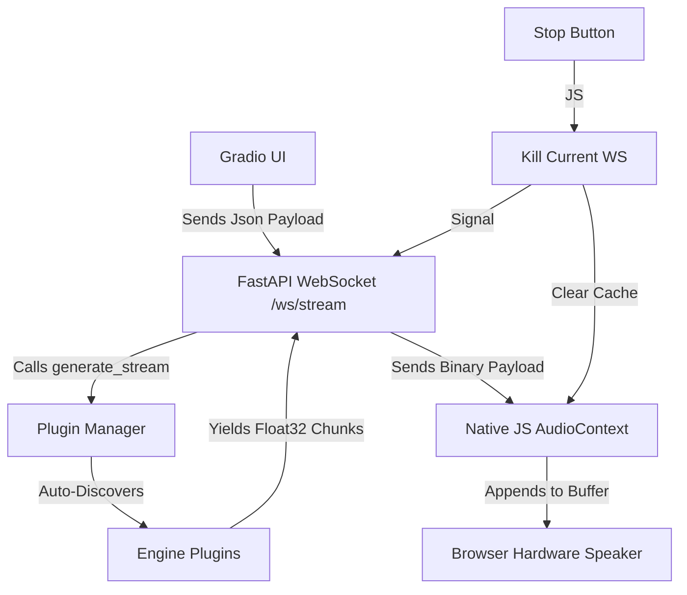

# Architecture Overview

The **Universal TTS Control Center** is a hybrid **FastAPI + Gradio** stack designed specifically to circumvent the audio buffering limitations found in standard high-level Web Frameworks.

## Components Breakdown

### 1. **FastAPI & Uvicorn**
The core process is a **FastAPI** application running on `uvicorn`. This allows us to mount a standard **Gradio** app on the root path (`/`) while exposing raw, high-performance **WebSocket** endpoints (`/ws/stream`) in the background.

### 2. **Native JavaScript Audio Engine**
Instead of using `<audio src="..."></audio>`, which browser buffers often cache and play with significant latency, we use a custom **`AudioContext` pipeline**. 
*   We open a binary WebSocket.
*   We receive raw `Float32` bytes.
*   We schedule each chunk to play at `audioCtx.currentTime + duration`.
*   This removes all "popping" or silent gaps between sentences.

### 3. The Plugin Manager (`app/engines/manager.py`)
This project uses a **Strategy Pattern** with **Dynamic Discovery**. 
*   **Auto-Discovery**: Any folder in `app/engines/` containing an `engine.py` with a `TTSPlugin` subclass is automatically loaded at startup.
*   **Decoupling**: The UI and WebSocket API interact only with the `TTSPlugin` abstract interface, ensuring that adding a new model requires zero changes to core files.

### 4. **Standardized Voice Cloning Architecture**
For models supporting zero-shot cloning (ZipVoice, Genie, NeuTTS, Chatterbox), the system follows a unified storage pattern:
*   **Audio Assets**: Reference audios are stored in `custom_voices/<engine_id>/`.
*   **Validation**: Each engine implements duration checks (e.g., 15s limit) in `save_clone` to prevent OOM or performance degradation.
*   **Dynamic Injection**: Clones appear instantly in the frontend dropdown without requiring a server restart.

### 5. **Models Data and Custom Voices**
*   `models_data/`: Centralized storage for static model weights. With `LOCALIZE_MODELS=True`, engines automatically fetch missing weights into these project-relative folders, making the app fully portable.
*   `custom_voices/`: Dynamic storage for user-generated voice clones. Each engine manages its own sub-folder.

### 6. **Chunking & Regex Strategy**
TTS models generate audio best when input is split into manageable sentences. We expose the **`split_pattern`** parameter to the frontend, allowing for:
- **Sentence-wise streaming**: Fast TTFA. Audio starts playing as soon as the first sentence is processed.
*   **Newline-wise streaming**: Faster than sentence-wise, but may result in longer silence if lines are very long.
*   **One-pass Batching**: High quality, but higher latency.

### 7. **Unified Management CLI (`tts_playground.sh`)**
The project provides a single entrypoint for lifecycle management:
- `./tts_playground.sh --install`: One-click setup of prerequisites and venv.
- `./tts_playground.sh --start`: Launches the FastAPI + Gradio stack using the correct environment.
- `./tts_playground.sh --stop`: Ensures all background processes are terminated.
- `./tts_playground.sh --purge`: Deep cleans models and environment for a fresh start.

---

## Metric Collection Logic

Metrics are collected using `performance.now()` in the browser:
1.  `reqStartTime`: Captured the moment the "Start" button is clicked.
2.  `firstChunkTime`: Captured the moment the first `onmessage` event with data arrives at the WebSocket.
3.  `totalAudioSeconds`: Computed by summing the `duration` of every scheduled `AudioBuffer`.

This gives the user an accurate view of exactly how responsive the model is on their hardware.
